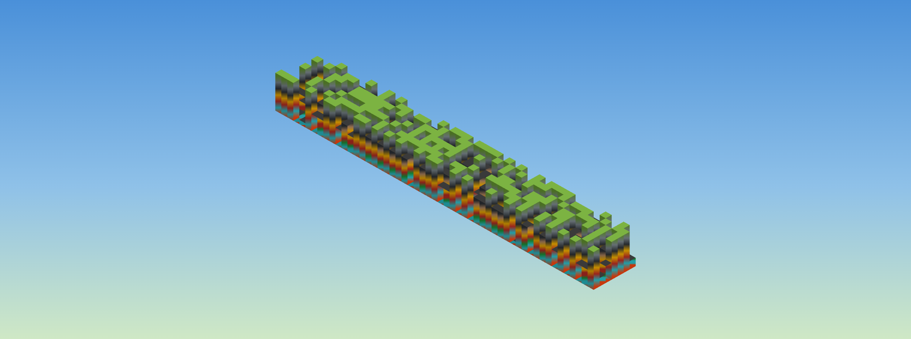

# GitMinecraft ⛏️

Turn any GitHub user's **contribution graph into a Minecraft underground mine**. Install the extension, visit anyone's profile, and click **⛏️ Minecraft** above the contribution graph — you mine whoever's profile you're viewing.

Days with no contributions are flat ground; the busier the day, the deeper you dig, uncovering layers from Dirt → Stone → Iron → Gold → **Lava**.

> Data is read directly from the GitHub page DOM — **no third-party APIs, no CORS issues, no need to enter usernames**.

## 🚀 Installation (30 seconds, Chrome / Edge / Brave / Arc)

> Not yet on the store; load via Developer Mode (one-time setup, stays active).

1. Go to [**Releases**](../../releases), download the latest `git-minecraft.zip`, and **extract** it.
2. Open `chrome://extensions` in your address bar (use `edge://extensions` for Edge).
3. Enable **Developer mode** in the top right corner.
4. Click **Load unpacked** and select the extracted folder.
5. Visit any GitHub profile (e.g., <https://github.com/torvalds>) and click **⛏️ Minecraft** above the contribution graph.

Once set up, it works on any profile. To uninstall, remove it via `chrome://extensions`.

## Screenshots



*Days with no contributions are flat grass; busier cells dig deeper, revealing layers of Dirt → Stone → Iron → Lava. The Loot panel in the top right automatically tracks your mining score.*


*View the mine and geological cross-sections from different angles, with glowing lava at the bottom. Supports 360° drag rotation and scroll zooming.*

## How to Play

Click the button to open the game **embedded directly in place of the contribution graph**. Click **⛶ Fullscreen** to expand, **✕ Exit** to restore, or press `Esc` to close.

Once opened, **auto-mining** begins: ores fly one by one into the "🎒 Loot" panel (satisfying coin collection effect), and your ⭐ Total Score accumulates in real-time.  
Supports **drag to rotate**, scroll to zoom, and **📸 Screenshot sharing** with username watermarks.

## Architecture

```
manifest.json   # MV3, injected into https://github.com/*
src/
  extract.js    # Reads DOM contribution graph → cells (date / level / count / week / dow)
  minecraft.js  # Isometric voxel engine + auto-mining, self-registered to GCA.games
  launcher.js   # Injects button bar + fullscreen overlay framework
styles.css      # gca-* shared + gmc-* voxels
icons/  test/
```

## Development / Testing

```bash
cd git-minecraft
python3 -m http.server 8733
# Open http://localhost:8733/test/mock.html
```

`test/mock.html` constructs a full 53-week contribution graph to verify data extraction and Minecraft mounting/unmounting.

## Roadmap

- [ ] Publish to Chrome Web Store / Firefox Add-ons
- [ ] **🎵 Melodic Gameplay**: Use columns as beats and levels as pitches to "play" your year
- [ ] Realistic block textures
- [ ] Multiple templates for sharing cards

## License

MIT
