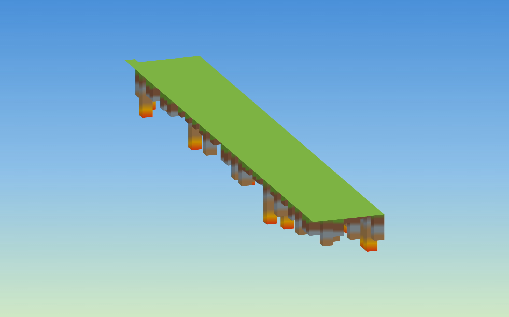
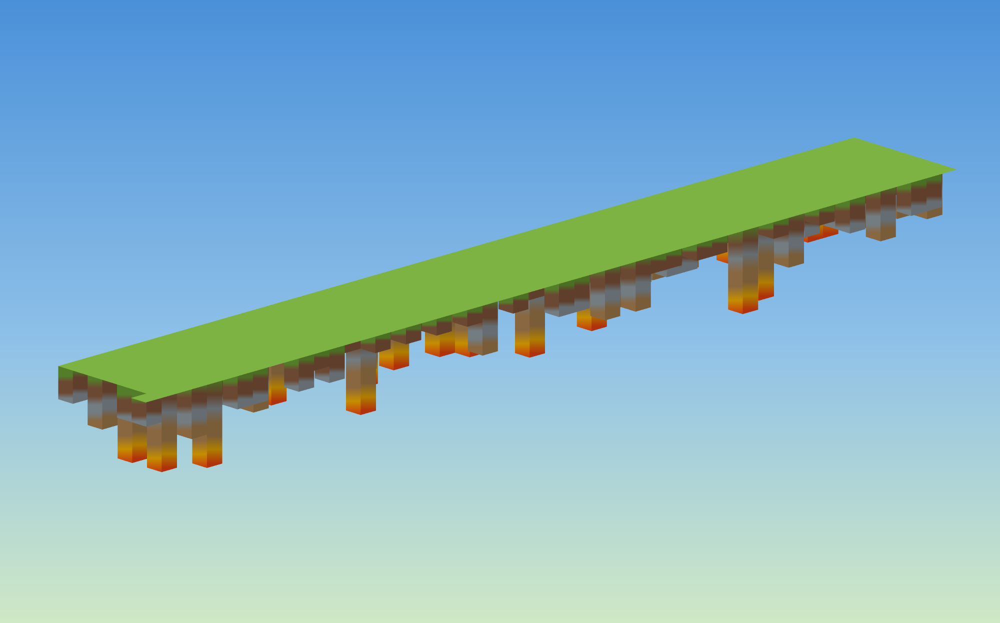

# GitHub Contribution Minecraft ⛏️

把任意 GitHub 用户的**贡献图变成 Minecraft 地下矿井**。装上扩展，访问任何人的主页，贡献图上方点 **⛏️ Minecraft** 即可——你看谁的主页，就挖谁的矿。

没有贡献的日子是平整地表，越忙的日子往下挖得越深，挖穿泥土→石头→铁矿→金矿→**岩浆**。

> 数据直接从 GitHub 页面 DOM 读取——**不调第三方 API、无 CORS、不用输用户名**。

## 🚀 安装（30 秒，Chrome / Edge / Brave / Arc）

> 还没上架商店，先用开发者模式加载（一次性，之后一直在）。

1. 到 [**Releases**](../../releases) 下载最新的 `github-contribution-arcade.zip` 并**解压**
2. 地址栏打开 `chrome://extensions`（Edge 用 `edge://extensions`）
3. 打开右上角 **开发者模式 / Developer mode**
4. 点 **加载已解压的扩展程序 / Load unpacked**，选刚解压出的文件夹
5. 打开任意 GitHub 主页（如 <https://github.com/torvalds>），点贡献图上方的 **⛏️ Minecraft**

完成后访问任何人的主页都能玩。卸载在 `chrome://extensions` 里移除。

## 截图



*贡献越多，地下矿柱越长，直达岩浆层。右上角战利品面板自动累计采矿得分。*



*正面视角：泥土→石头→铁矿→岩浆的完整地层剖面，鼠标拖拽 360° 旋转。*

## 玩法

点按钮后游戏**在贡献图原位内嵌打开**；点 **⛶ 全屏** 放大，**✕ 退出** 还原，`Esc` 关闭。

打开后**自动开采**：矿石逐个飞入右上「🎒 战利品」面板（金币收集感），⭐ 总分实时累加。  
鼠标**拖拽旋转** · 滚轮缩放 · **📸 截图分享**带用户名水印。

## 架构

```
manifest.json   # MV3，注入 https://github.com/*
src/
  extract.js    # 读 DOM 贡献图 → cells（date / level / count / week / dow）
  minecraft.js  # 等距体素引擎 + 自动采矿，自注册到 GCA.games
  launcher.js   # 注入按钮条 + 全屏 overlay 框架
styles.css      # gca-* 共享 + gmc-* 体素
icons/  test/
```

## 开发 / 测试

```bash
cd github-contribution-arcade
python3 -m http.server 8733
# 打开 http://localhost:8733/test/mock.html
```

`test/mock.html` 构造完整 53 周贡献图，验证数据提取和 Minecraft 挂载/卸载。

## Roadmap

- [ ] 上架 Chrome Web Store / Firefox Add-ons
- [ ] **🎵 旋律玩法**：每列当节拍、level 当音高，"播放"你的一年
- [ ] 方块真实材质贴图
- [ ] 分享卡片多模板

## License

MIT
